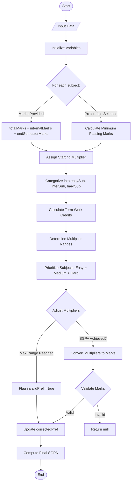

# AceGrade - SGPA Prediction App

🚀 **AceGrade** is an Android app designed for Mumbai University students to help them predict and achieve their desired SGPA efficiently. The app utilizes a custom algorithm to generate the minimum marks combination required based on user preferences, ensuring students have a clear understanding of their academic goals.

## ⭐ Key Features

1. **Target Marks Prediction** - Calculates the marks required in each subject to achieve the desired SGPA.
2. **SGPA Prediction** - Estimates SGPA based on expected or achieved marks.
3. **Marks Combination Handling** - Provides clear explanations and proper representation for each case, ensuring accuracy and transparency.

## 📱 Technology Stack

- **Frontend:** XML (UI/UX design), custom components (EditText, Buttons, Dropdowns, CardView, RecyclerView for structured design).
- **Backend:** Java (Prediction algorithm, data handling, interactive effects, animations, haptic feedback for errors).
- **Database & Analytics:** Firebase (Bug tracking, user input data analysis for reliability and accuracy).

---

## Screenshots 📸 

<div style="display: flex; flex-wrap: wrap; gap: 50px;">
  
  
  
  
  
  
  
  
  
  
  
 
---

## 📱 Demo (GIFs) 

<div style="display: flex; justify-content: center; align-items: center;">
    
</div>

---

# 📖 SGPA Prediction Algorithm

## Step 1: Input Data
### User Inputs:
- **Subject Preferences:** Easy (0), Medium (1), or Hard (2) for incomplete subjects.
- **Actual Marks:** End-semester marks for completed subjects (if any).
- **Term Work Marks:** Marks scored in term work for each subject.
- **Internal Marks:** Marks from unit tests.
- **Desired SGPA:** Target SGPA the user wants to achieve.

## Step 2: Initialize Variables
### For each subject:
#### If Marks Are Provided:
Calculate total marks:
```java 
totalMarks = internalMarks + endSemesterMarks;
```
#### If Preference Is Selected:
Calculate minimum passing marks based on the subject’s range:

| Range | Passing Marks Formula |
|-------|-----------------------|
| 80    | internalMarks + 32    |
| 60    | internalMarks + 24    |
| 45    | internalMarks + 18    |

Assign a starting multiplier based on the subject’s range and calculated passing marks.

Example: For an 80-range subject, use:
```java
Range.sub.getMultiplierFor100(interPlusPass);
```
Categorize Subjects:
- Group subjects into `easySub`, `interSub`, or `hardSub` lists based on preferences.

## Step 3: Calculate Term Work Credits
Sum term work credits using the function and iterative loop over the number of subjects:
```java
termWorkSum += Range.sub.subTwGetCredit(termWorkMarks, termWorkCredit);
```

## Step 4: Determine Multiplier Ranges
### Start Range:
The iteration count at which multiplier incrementation begins for a subject depends on preference combinations:

| Combination         | Easy | Medium | Hard |
|---------------------|------|--------|------|
| Easy + Medium + Hard | 0    | 2      | 3    |
| Easy + Medium      | 0    | 2      | -    |
| Medium + Hard      | -    | 0      | 2    |
| Easy + Hard      | 0    | -    | 2    |

### End Range:
The maximum allowed multiplier for a subject:

| Preference | End Range Formula |
|------------|------------------|
| Easy       | 10               |
| Medium     | startMul + 2 (if 5/6) else startMul + 3 |
| Hard       | startMul + 1 (if 5/6) else startMul + 2 |

## Step 5: Adjust Multipliers to Achieve SGPA
### Prioritize Subjects:
Order of adjustment:
1. Easy → Medium → Hard subjects.
2. 2-credit subjects within each category.
```java
public static void getPriority(ArrayList<Integer> pref, List<Integer> l, int[] internalMrks, int[] internalRange) {
        ArrayList<Integer> temp = new ArrayList<>(pref); // Copy of pref array to make changes. like removing element which has 2 credit and added to list l, such that there will be no repetition
        boolean have2Credit = true;
        
        for (int i = 0; i < pref.size(); i++) {
            if (have2Credit) { // priority based on small credit 
                int index = findCredit(temp); // finding index of sub which has 2 credits. returns -1 if not found  
                if (index != -1) { // found 2 credit sub
                    l.add(temp.get(index));
                    temp.remove(index);
                } else { // not found 2 credit sub
                    have2Credit = false;
                }
            }
            if (!have2Credit) { // priority based on unit test marks 
                int minInterMrkDiff = Integer.MAX_VALUE; // to store the minimum unit test marks diff (sub with maximum marks).
                int index = 0;
                for (int j = 0; j < temp.size(); j++) {
                    int diff = internalRange[temp.get(j)] - internalMrks[temp.get(j)]; // calculating the diff. ex - MATHS 22/25 then diff = 25-22 = 3, BEE 45/50 then diff = 50-45 = 5
                    if (diff < minInterMrkDiff) {
                        minInterMrkDiff = diff; // updating minimum diff 
                        index = j; // storing the index of sub with maximum marks in unit test 
                    }
                } 
                l.add(temp.get(index)); // storing the index of sub according to the priority
                temp.remove(index); // removing sub as it is stored in list l.
            }
        }
        temp.clear();
    }

    private static int findCredit(ArrayList<Integer> a) {
        int index=0;
        for (int i : a) {
            if (getCredit(i) == 2) return index;
            index++;
        }
        return -1;
    }
```

### Increment Multipliers:
For each prioritized subject:
- Increment its multiplier until:
  - The calculated SGPA ≥ desired SGPA (`sgpaTC`).
  - The multiplier reaches its `endRange`.
- Exit loop if all subjects hit their `endRange` and SGPA is still unmet (flag `invalidPref`).
```java
int cnt = 0;
while (sgpaTC > subCreditSum(sub) + sum) {
   boolean flag = true;
    for (int i = 0; i < numOfSub; i++) {
        if (!isEndSemMarks[subPriority[i]]) { //checking if the user has provided end sem marks for this sub, if it is then no incrementation as the marks are already provided.
           if (sub[subPriority[i]] < endRange[subPriority[i]] && cnt >= startRange[subPriority[i]]) sub[subPriority[i]]++; // this logic will allow to increment easy sub first and then inter followed by hard.
           if (sgpaTC <= subCreditSum(sub) + sum) break; //after each incrementation we will check if the required sgpa is reached or not.
        }
        if (sub[i] != endRange[i]) if (!isEndSemMarks[i]) flag = false; // if each sub's multiplier is equal to the end range after incrementation then we will break the loop. this is necessary as the loop will run infinitely if the prefs are not able to align with the desired SGPA. in this case each sub multiplier have reached there maximum range acc to prefs.
    }
    if (flag) break;
    cnt++;
}
```

## Step 6: Validate & Calculate Final Marks
### Convert Multipliers to Marks:
Use subject range-specific methods:
```java
// For 80-range subjects:
marks = Range.sub.getMarksFor100(multiplier, interPlusPass) - internalMarks;
```
### Validation:
- Ensure `marks ≤ subject’s maximum range` (e.g., ≤80 for 80-range subjects).
- If marks exceed range, return `null` (invalid case), else return the final set of marks for each subject.

### Update Preferences:
- Adjust `correctedPref` if multipliers exceed preference limits (e.g., Easy → Medium).

## Step 7: Compute Final SGPA
- If actual marks were provided, directly compute SGPA by calling the `calculateSgpa` function.
```java
preTC = calculateSgpa(termWorkMrks, internalMrks, endSemMrks);
```
- Otherwise, calculate total credits and store it into preTC:
```java
preTC = subCreditSum(sub) + sum;
```
### SGPA Formula:
- Round SGPA upto 2 decimal places.
```java
preTC = Math.round((preTC / Credits)*100)/100f; 
```
## Definitions
## Multiplier :
- A multiplier is the number used to calculate total credit scored per subject.
- Example: If a subject has **3 credits** and the **desired SGPA is 8**, the multiplier will be adjusted based on the subject preference. If it's an **easy** subject, the multiplier will likely range **between 6 and 10**. If determined as **9**, the total credit for that subject would be : `3 * 9 = 27`


---

## 📊 Flowchart

For a visual representation of the workflow, see the flowchart below:



---

## Installation 📲

### Prerequisites
- **Android Studio** (latest version recommended).
- **Java Development Kit (JDK 11+)** installed.
- An Android device or emulator (API level 24 or higher).

### Steps
1. **Clone the repository**:
```bash
git clone https://github.com/vividron/AceGrade.git
```
2. **Open the project in Android Studio**:
  - Launch Android Studio → `Open` → Navigate to the cloned `AceGrade` directory.
3. **Build the project**:
  - Wait for Gradle to sync dependencies automatically.
  - If prompted, install missing SDK packages or update plugins.
4. **Run the app**:
  - Connect an Android device or start an emulator.
  - Click the `Run` button (▶️) in Android Studio to install and launch the app.
  
---
   
## 💬 Feedback

Your feedback is valuable! Please download the app and share your thoughts to help improve the experience.

📧 Contact: [ronaks21205@gmail.com]

---
